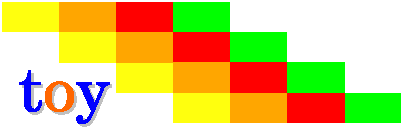

=================
 toy user manual
=================

+-------------------+----------------------------------------------------------+
| **Title**         | toy (Assembler and simulator for the Princeton TOY       |
|                   | machine)                                                 |
+-------------------+----------------------------------------------------------+
| **Author**        | Nikolaos Kavvadias 2010, 2011, 2012, 2013, 2014, 2015,   |
|                   | 2016                                                     |
+-------------------+----------------------------------------------------------+
|                   | ``toy.c`` written by Christopher W. Fraser.              |
+-------------------+----------------------------------------------------------+
| **Contact**       | nikos@nkavvadias.com                                     |
+-------------------+----------------------------------------------------------+
| **Website**       | http://www.nkavvadias.com                                |
+-------------------+----------------------------------------------------------+
| **Release Date**  | 02 December 2014                                         |
+-------------------+----------------------------------------------------------+
| **Version**       | 0.0.3                                                    |
+-------------------+----------------------------------------------------------+
| **Rev. history**  |                                                          |
+-------------------+----------------------------------------------------------+
|        **v0.0.3** | 2014-12-02                                               |
|                   |                                                          |
|                   | Added project logo to README.                            |
+-------------------+----------------------------------------------------------+
|        **v0.0.2** | 2014-10-27                                               |
|                   |                                                          |
|                   | Updated for Github.                                      |
+-------------------+----------------------------------------------------------+
|        **v0.0.1** | 2010-12-06                                               |
|                   |                                                          |
|                   | Initial release.                                         |
+-------------------+----------------------------------------------------------+

.. _TOY: http://introcs.cs.princeton.edu/java/50machine/
.. _`Chris Fraser`: http://www.well.com/~cwf/pro/vita.htm
.. _`TOY reference card`: http://introcs.cs.princeton.edu/java/53isa/cheatsheet.txt

1. Introduction
===============

``toy`` is a collection of software development tools for the Princeton TOY_ 
processor. ``toyasm`` is a single-pass assembler and ``toy`` is the TOY 
simulator by `Chris Fraser`_.

2. File listing
===============

The ``toy`` distribution includes the following files:
   
+-----------------------+------------------------------------------------------+
| /toy                  | Top-level directory                                  |
+-----------------------+------------------------------------------------------+
| AUTHORS               | List of ``toy`` authors.                             |
+-----------------------+------------------------------------------------------+
| LICENSE               | The modified BSD license governs ``toy``.            |
+-----------------------+------------------------------------------------------+
| Makefile              | Makefile for ``toy`` and ``toyasm``.                 |
+-----------------------+------------------------------------------------------+
| README.html           | HTML version of README.                              |
+-----------------------+------------------------------------------------------+
| README.pdf            | PDF version of README.                               |
+-----------------------+------------------------------------------------------+
| README.rst            | This file.                                           |
+-----------------------+------------------------------------------------------+
| VERSION               | Current version of the project sources.              |
+-----------------------+------------------------------------------------------+
| fibo.asm              | TOY assembly implementation of Fibonacci's algorithm.|
+-----------------------+------------------------------------------------------+
| fibo.c                | Reference implementation of Fibonacci sequence       |
|                       | generation in ANSI C.                                |
+-----------------------+------------------------------------------------------+
| fibo.toy              | TOY machine code file of ``fibo.asm`` for the ``toy``|
|                       | simulator.                                           |
+-----------------------+------------------------------------------------------+
| main.c                | Driver C file for the ``toyasm`` assembler.          |
+-----------------------+------------------------------------------------------+
| popcount.asm          | TOY assembly implementation of population count.     |
+-----------------------+------------------------------------------------------+
| popcount.c            | Reference implementation of population count in ANSI |
|                       | C.                                                   |
+-----------------------+------------------------------------------------------+
| popcount.toy          | TOY machine code file of ``popcount.asm`` for the    |
|                       | ``toy`` simulator.                                   |
+-----------------------+------------------------------------------------------+
| rst2docs.sh           | Bash script for generating the HTML and PDF versions |
|                       | of the documentation (README).                       |
+-----------------------+------------------------------------------------------+
| toy.c                 | The ``toy`` simulator.                               |
+-----------------------+------------------------------------------------------+
| toy.l                 | Lexer for the TOY assembler.                         |
+-----------------------+------------------------------------------------------+
| toy.png               | PNG image for the ``toy`` project logo.              |
+-----------------------+------------------------------------------------------+
| toy.y                 | Parser for the TOY assembler.                        |
+-----------------------+------------------------------------------------------+
| toy-cheatsheet.txt    | `TOY reference card`_                                |
+-----------------------+------------------------------------------------------+

3. Usage
========

1. Run ``make`` from the Cygwin/MinGW/Linux command line:

::

  $ make clean
  $ make

2. Run a test for ``fibo``:

::

  $ ./toyasm[.exe] fibo.asm > fibo.toy
  $ ./toy[.exe] fibo.toy

When prompted give a 16-bit hexadecimal constant (e.g. ``0008``) from ``stdin`` 
(the ``toy`` simulator features an interactive console).
Then the simulator executes and prints ``0015`` (``21`` in decimal) as the 
correct result for the 8-th element of Fibonacci's sequence.

Similarly, you can run a test for ``popcount`` by entering a hexadecimal number; 
the TOY simulator console will then return the number of ones in that number.

4. Prerequisites
================

- Standard UNIX-based tools: ``make``, ``gcc``.

